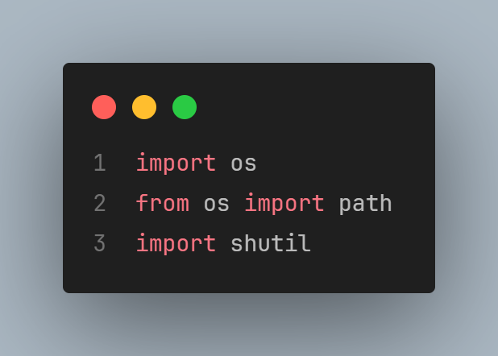
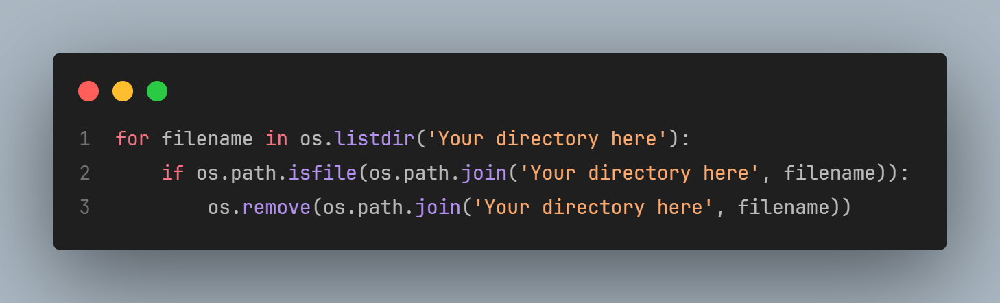
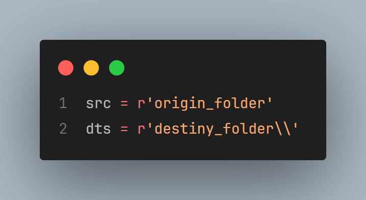
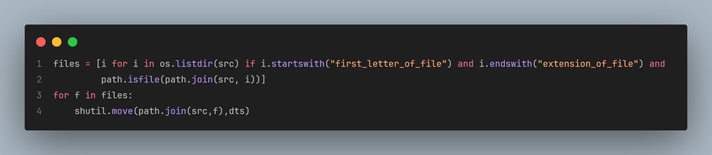
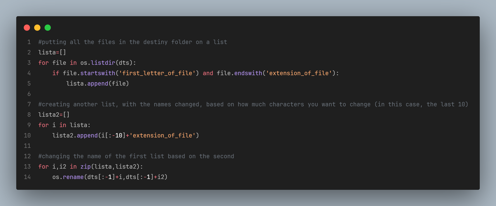

# File Name Changer 📝
This file can be used for moving files between folders and changing it names based on what the users wants.

## 📌 Importing the libraries
In this file, the libraries used are **os** and **shutil**. **OS** is used to move the file between folders and **shutil** to change the names.

## 📌 Erasing unnecessary files
If the user have a backup folder, with files that will not use anymore, this erase all files in the folder.

## 📌 Selecting the source and destiny folders
This part is to specify what is the source and the destiny folders of the files.

## 📌 List Comprehension
**List Comprehension** to move the files from the source to the destiny folder.

## 📌 Rename the Files
This part of the script creates two lists, which the first one will store the original names, and the second will change the original names based on the user's preference.

Let me know if something can make this code better and easier to be developed.

# Enjoy!! 😎